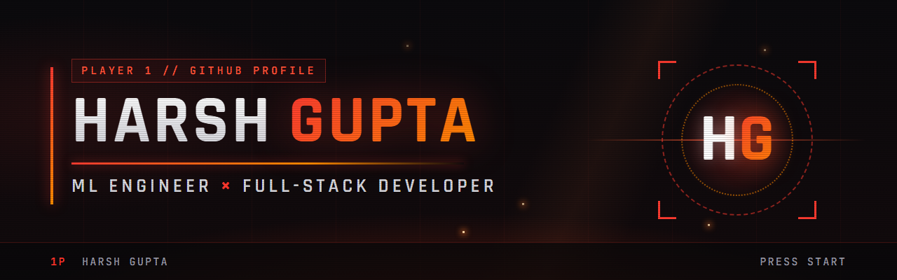

<p align="center">
  <a href="https://www.harshgupta.co.in"></a>
  <a href="https://www.linkedin.com/in/harshfiu"></a>
  <a href="mailto:harsh370hg@gmail.com"></a>
  
</p>

### `// PLAYER PROFILE`

- 🎓 B.Tech CSE @ **SRM IST Kattankulathur**, Class of '27
- 🧠 ML engineer first, full-stack second — I train models when rules aren't enough
- 📄 Published **pothole detection & priority ranking** research — *iJRDO, Apr 2026*
- 💼 Ex **Software Developer Intern @ DHub Technologies LLC** (Dallas, TX — remote)
- 🏅 **Microsoft Certified: Azure AI Fundamentals**
- 📫 **harsh370hg@gmail.com** — open to ML / full-stack roles

### `// ARCADE` — Builds

- **RoadIntel** — report road damage from a photo and a GPS fix; the dashboard ranks which road gets fixed first &nbsp;·&nbsp; [app](https://github.com/harshfiu/RoadIntel-Mobile) · [admin](https://github.com/harshfiu/RoadIntel-Admin)
- **Credit Card Fraud Detection** — five models compared, where accuracy is a trap &nbsp;·&nbsp; [repo](https://github.com/harshfiu/Credit-Card-Fraud_Detection-System)
- **5G Performance Dashboard** — live carrier comparison on four metrics, and it calls the winner &nbsp;·&nbsp; [repo](https://github.com/harshfiu/5G-Network-Performance-Dashboard-Project)
- **Portfolio** — a Tekken 7 fight screen that happens to be a portfolio &nbsp;·&nbsp; [site](https://www.harshgupta.co.in)

### `// TECH LOADOUT`

<p>
  
</p>

### `// COMBAT STATS`

```
MACHINE LEARNING       ████████████████░░░░  80   PyTorch · scikit-learn · XGBoost · YOLOv8
PROGRAMMING LANGUAGES  ███████████████████░  90   Python · JavaScript · SQL
FRAMEWORKS             ██████████████████░░  85   React · React Native · Node · Flask
DATABASES              █████████████████░░░  82   PostgreSQL · MySQL · MongoDB
```

<sub>Fan design inspired by Tekken 7. Not affiliated with Bandai Namco.</sub>
